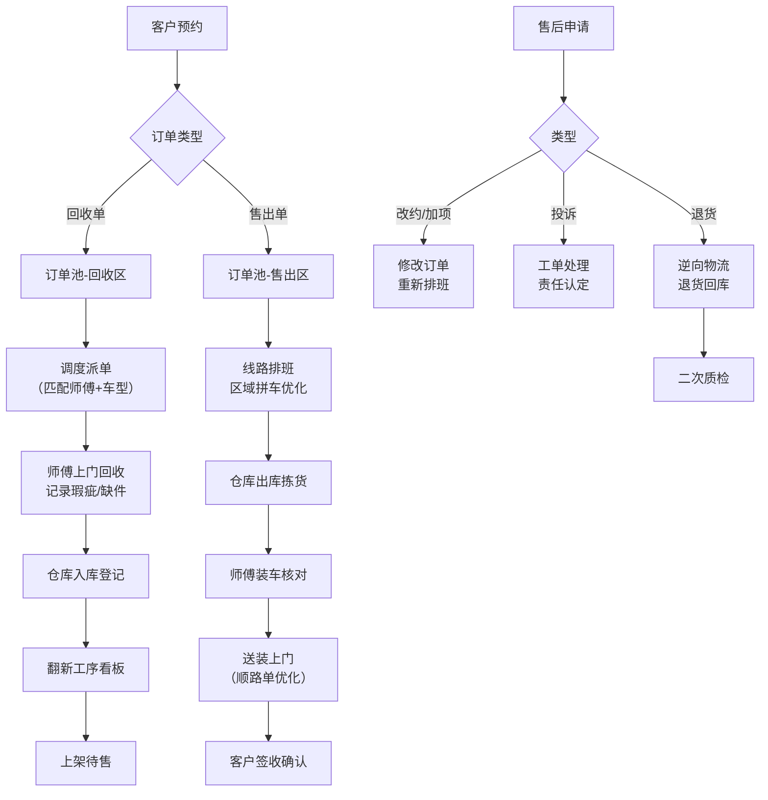

## 1. 产品概述

二手家具履约调度平台是一款面向二手家具商家、寄售仓和回收门店的内部运营系统，聚焦于"收旧-翻新-售卖-送装-退货"全链路的拆装配送撮合效率与售后可追溯性。系统通过6大核心模块，将分散的门店日常作业统一到数字化工作台中。

**核心价值：**
- 提升师傅排班与车辆装载效率 30%+
- 实现售后瑕疵追溯闭环，降低客诉率
- 沉淀小区/写字楼上楼规则知识库
- 实时掌握门店经营数据与履约健康度

---

## 2. 核心功能

### 2.1 用户角色

| 角色 | 核心权限 |
|------|----------|
| 调度员 | 订单池管理、线路排班、派单转派、改约处理 |
| 仓库管理员 | 出入库交接、仓内翻新任务、库存盘点 |
| 师傅队长 | 查看当日任务、完工上报、异常反馈 |
| 门店经营者 | 经营看板、数据分析、规则配置 |
| 售后专员 | 客户投诉处理、退货回库、赔偿审核 |

### 2.2 模块清单

1. **订单池**：回收单/售出单双流程管理、批量筛选、智能派单建议
2. **线路排班**：按区域时段拼车、顺路单/返仓带货单优化、车次装载清单
3. **师傅管理**：内外部师傅混排、完工率/投诉率统计、技能标签
4. **仓内任务**：出入库交接、翻新工序、拆前瑕疵记录、缺件风险登记
5. **售后中心**：客户改约、临时加项、退货回库、投诉处理跟踪
6. **经营看板**：KPI仪表盘、区域热力图、师傅排名、装载效率分析

### 2.3 页面详情

| 模块 | 子功能 | 详细说明 |
|------|--------|----------|
| 订单池 | 订单列表 | 区分回收单/售出单卡片视图，支持多维度筛选（品类、区域、时段、优先级） |
| 订单池 | 订单详情 | 客户信息、家具品类清单、预设人数/车型、拆前瑕疵记录、上楼限制 |
| 订单池 | 智能派单 | 根据师傅位置、技能匹配度、当日负载自动推荐派单方案 |
| 线路排班 | 日历视图 | 按日期/时段展示当日车次安排，支持拖拽调整 |
| 线路排班 | 拼车优化 | 按区域+时段批量合并订单，生成最优线路，显示装载率 |
| 线路排班 | 装载清单 | 每车次订单明细、家具件数、体积重量、装卸顺序建议 |
| 师傅管理 | 师傅档案 | 个人信息、身份证/驾驶证、技能标签（沙发/床柜/拆装能手） |
| 师傅管理 | 绩效统计 | 完工率、投诉率、准时率、平均单耗时，支持周/月维度 |
| 师傅管理 | 排班日历 | 内外部师傅统一排班视图，请假/休息标记 |
| 仓内任务 | 入库登记 | 回收家具入库、拍照留档、瑕疵/缺件记录、翻新计划分配 |
| 仓内任务 | 出库交接 | 售出单拣货、装车核对、与师傅签字交接 |
| 仓内任务 | 翻新进度 | 各工序进度看板（清洗-修补-上漆-质检） |
| 售后中心 | 改约/加项 | 客户改约申请处理、临时加项（如额外拆装、上楼费） |
| 售后中心 | 退货回库 | 退货单流程、逆向物流安排、二次质检、重新上架 |
| 售后中心 | 投诉工单 | 投诉登记、责任认定（师傅/仓库/客户）、赔偿/安抚方案 |
| 经营看板 | KPI总览 | 今日订单、完工数、在途数、超时预警、投诉数 |
| 经营看板 | 数据图表 | 区域订单热力图、师傅绩效排行榜、装载率趋势 |
| 经营看板 | 规则库 | 小区/写字楼上楼限制（电梯尺寸、禁运时段、楼层加价规则） |

---

## 3. 核心流程

### 3.1 回收单流程
客户预约 → 订单池录入（品类+人数+车型预设）→ 调度派单 → 师傅上门回收（记录拆前瑕疵）→ 仓库入库登记 → 翻新工序 → 上架待售

### 3.2 售出单流程
客户下单 → 仓库拣货出库 → 线路排班拼车 → 安排送装（顺路单优化）→ 师傅送装到家 → 客户签收 → 完工确认

### 3.3 售后退货流程
客户申请退货 → 售后审核 → 生成退货回库单 → 安排逆向物流（可与送装单顺路）→ 仓库二次质检 → 翻新或报废处理

### 3.4 Mermaid 流程图

---

## 4. 用户界面设计

### 4.1 设计风格
- **主色调**：工业橙 `#F26B3A`（代表高效行动力）+ 深墨绿 `#1B4332`（代表环保回收理念）
- **辅助色**：琥珀黄 `#FFBA08`（警告/待处理）、青瓷蓝 `#4CC9F0`（在途/进行中）
- **中性色**：冷灰系列 `#F8F9FA / #E9ECEF / #ADB5BD / #495057 / #212529`
- **按钮风格**：微圆角（6px）、悬浮阴影提升、点击凹陷反馈
- **字体方案**：思源黑体 / Noto Sans SC（中文正文）+ JetBrains Mono（数据编号）
- **布局风格**：侧边栏导航 + 顶部信息栏 + 内容卡片区，采用信息密度较高的工作台设计
- **图标**：Lucide 图标库，线性风格，统一 1.5px 线宽

### 4.2 页面设计概述

| 模块 | 核心UI元素 | 交互特点 |
|------|-----------|----------|
| 订单池 | 双Tab切换（回收/售出）、高级筛选面板、状态标签、优先级色条 | 拖拽派单、批量选择、卡片快速预览 |
| 线路排班 | 日历时间轴、地图区域分组、车辆卡片、装载进度条 | 拖拽调整顺序、一键拼车、导出装载单 |
| 师傅管理 | 头像网格、绩效雷达图、技能标签、状态指示灯 | 排班拖拽、绩效详情下钻、批量排班 |
| 仓内任务 | 工序看板（Kanban列）、入库拍照上传、瑕疵标注工具 | 工序流转拖拽、扫码出入库 |
| 售后中心 | 工单分类漏斗、处理时效倒计时、责任标签 | 工单状态流转、聊天记录留存 |
| 经营看板 | KPI数字卡片、ECharts图表、热力地图、规则配置表单 | 数据下钻钻取、时间范围切换 |

### 4.3 响应式
- **桌面端优先**：最小支持 1366×768，主力优化 1920×1080 分辨率
- **信息密度**：工作台场景采用紧凑模式，侧边栏可折叠以获得更大内容区
- **平板适配**：768px 以上保持完整功能，侧边栏转为抽屉模式
