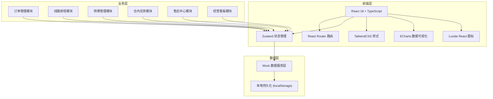
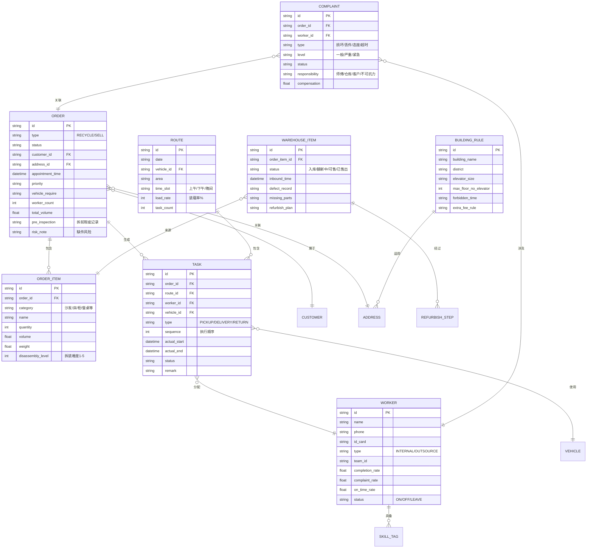

## 1. 架构设计



---

## 2. 技术选型说明

| 层级 | 技术 | 版本 | 用途 |
|------|------|------|------|
| 构建工具 | Vite | 5.x | 极速开发构建，支持 React + TS |
| 前端框架 | React | 18.x | 函数式组件 + Hooks |
| 类型系统 | TypeScript | 5.x | 严格类型检查 |
| 路由管理 | react-router-dom | 6.x | 单页路由导航 |
| 状态管理 | zustand | 4.x | 轻量级全局状态 |
| CSS框架 | TailwindCSS | 3.x | 原子化样式系统 |
| UI 图标 | lucide-react | 0.x | 线性风格图标库 |
| 图表库 | echarts | 5.x | 经营看板数据可视化 |
| 后端 | 无（前端Mock） | - | 纯前端演示，localStorage 持久化 |

---

## 3. 路由定义

| 路由路径 | 页面 | 说明 |
|----------|------|------|
| `/dashboard` | 经营看板 | 首页，KPI 总览与数据图表 |
| `/orders` | 订单池 | 回收单/售出单管理，默认回收单 Tab |
| `/orders/recycle` | 回收订单 | 回收单列表 |
| `/orders/sell` | 售出订单 | 售出单列表 |
| `/orders/:id` | 订单详情 | 查看单个订单完整信息 |
| `/routing` | 线路排班 | 日历时间轴、拼车优化、装载清单 |
| `/workers` | 师傅管理 | 师傅档案、绩效统计、排班日历 |
| `/warehouse` | 仓内任务 | 出入库、翻新工序看板 |
| `/aftersales` | 售后中心 | 改约、退货、投诉工单处理 |

---

## 4. 数据模型定义

### 4.1 核心实体 ER 图



### 4.2 品类预设配置

```typescript
interface CategoryPreset {
  category: string;
  icon: string;
  defaultWorkers: number;
  defaultVehicle: 'VAN' | 'TRUCK_SMALL' | 'TRUCK_MEDIUM';
  defaultVolume: number; // m³
  disassemblyLevel: 1 | 2 | 3 | 4 | 5;
  keywords: string[];
}

const CATEGORY_PRESETS: CategoryPreset[] = [
  { category: '三人沙发', icon: 'sofa', defaultWorkers: 2, defaultVehicle: 'VAN', defaultVolume: 1.8, disassemblyLevel: 3, keywords: ['沙发', 'sofa'] },
  { category: '双人床', icon: 'bed', defaultWorkers: 2, defaultVehicle: 'VAN', defaultVolume: 1.2, disassemblyLevel: 3, keywords: ['床', 'bed'] },
  { category: '大衣柜', icon: 'door-open', defaultWorkers: 3, defaultVehicle: 'TRUCK_SMALL', defaultVolume: 2.5, disassemblyLevel: 5, keywords: ['衣柜', '衣橱'] },
  { category: '餐桌+椅', icon: 'utensils', defaultWorkers: 2, defaultVehicle: 'VAN', defaultVolume: 1.0, disassemblyLevel: 2, keywords: ['餐桌', '饭桌'] },
  { category: '电视柜', icon: 'tv', defaultWorkers: 2, defaultVehicle: 'VAN', defaultVolume: 0.8, disassemblyLevel: 2, keywords: ['电视柜'] },
  { category: '书柜', icon: 'book-open', defaultWorkers: 2, defaultVehicle: 'VAN', defaultVolume: 1.5, disassemblyLevel: 4, keywords: ['书柜', '书架'] },
  { category: '茶几', icon: 'coffee', defaultWorkers: 1, defaultVehicle: 'VAN', defaultVolume: 0.3, disassemblyLevel: 1, keywords: ['茶几', '边几'] },
  { category: '床垫', icon: 'square', defaultWorkers: 2, defaultVehicle: 'VAN', defaultVolume: 0.9, disassemblyLevel: 1, keywords: ['床垫'] },
];
```

---

## 5. 项目目录结构

```
.
├── src/
│   ├── main.tsx                    # 入口文件
│   ├── App.tsx                     # 根组件 + 路由
│   ├── index.css                   # Tailwind + 全局样式
│   ├── components/
│   │   ├── layout/
│   │   │   ├── Sidebar.tsx         # 侧边栏导航
│   │   │   ├── Topbar.tsx          # 顶部信息栏
│   │   │   └── Card.tsx            # 通用卡片容器
│   │   ├── common/
│   │   │   ├── StatusBadge.tsx     # 状态标签组件
│   │   │   ├── PriorityTag.tsx     # 优先级标签
│   │   │   ├── EmptyState.tsx      # 空状态
│   │   │   ├── FilterBar.tsx       # 通用筛选栏
│   │   │   └── StatCard.tsx        # KPI 统计卡片
│   │   └── orders/
│   │   └── routing/
│   │   └── workers/
│   │   └── warehouse/
│   │   └── aftersales/
│   │   └── dashboard/
│   ├── pages/
│   │   ├── Dashboard.tsx           # 经营看板
│   │   ├── Orders.tsx              # 订单池
│   │   ├── OrderDetail.tsx         # 订单详情
│   │   ├── Routing.tsx             # 线路排班
│   │   ├── Workers.tsx             # 师傅管理
│   │   ├── Warehouse.tsx           # 仓内任务
│   │   └── AfterSales.tsx          # 售后中心
│   ├── store/
│   │   ├── useOrderStore.ts        # 订单状态
│   │   ├── useWorkerStore.ts       # 师傅状态
│   │   ├── useRouteStore.ts        # 线路状态
│   │   ├── useWarehouseStore.ts    # 仓库状态
│   │   └── useAfterSalesStore.ts   # 售后状态
│   ├── data/
│   │   ├── mockOrders.ts           # 订单Mock
│   │   ├── mockWorkers.ts          # 师傅Mock
│   │   ├── mockRoutes.ts           # 线路Mock
│   │   ├── mockWarehouse.ts        # 仓库Mock
│   │   ├── mockBuildingRules.ts    # 上楼规则Mock
│   │   └── categoryPresets.ts      # 品类预设
│   ├── types/
│   │   ├── order.ts                # 订单类型
│   │   ├── worker.ts               # 师傅类型
│   │   ├── route.ts                # 线路类型
│   │   ├── warehouse.ts            # 仓库类型
│   │   └── aftersales.ts           # 售后类型
│   └── utils/
│       ├── formatters.ts           # 日期/金额格式化
│       ├── validators.ts           # 校验函数
│       └── storage.ts              # localStorage 封装
├── .trae/
│   └── documents/
│       ├── product-requirements.md
│       └── technical-architecture.md
├── vite.config.ts
├── tailwind.config.js
├── tsconfig.json
├── package.json
└── index.html
```

---

## 6. 核心业务规则实现说明

### 6.1 智能拼车算法
- **约束条件**：同一区域 + 同一时段（上午/下午/晚间）
- **装载率目标**：≥ 70% 触发拼车
- **顺路度计算**：两单地址间直线距离 ≤ 3km 视为顺路
- **返仓带货**：送装单终点与仓库距离 ≤ 5km 时，可夹带回收单回仓

### 6.2 自动转派机制
- 新单发出后 15 分钟无师傅接单 → 自动提升优先级至紧急
- 30 分钟仍无接单 → 自动推送至外部合作队池
- 60 分钟仍无接单 → 生成调度预警，通知人工介入

### 6.3 绩效统计规则
- **完工率** = （按时完工单数 / 分配总工单数）× 100%
- **投诉率** = （有责投诉数 / 完工单数）× 100%
- **准时率** = （预约时段 ±30min 内到达单数 / 总工单数）× 100%
- **连续3个月投诉率 > 5%**：系统标记，需人工审核是否解约
